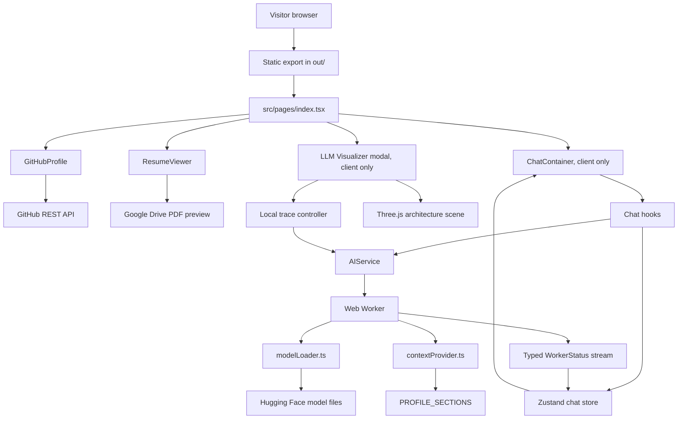
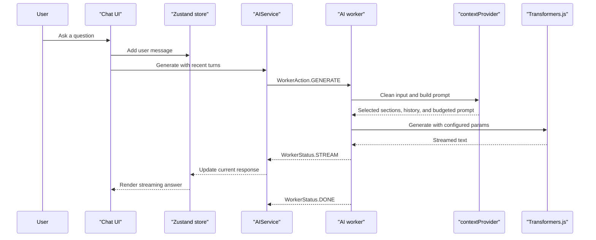
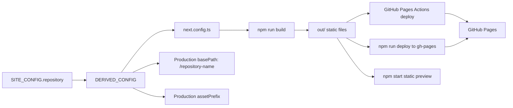
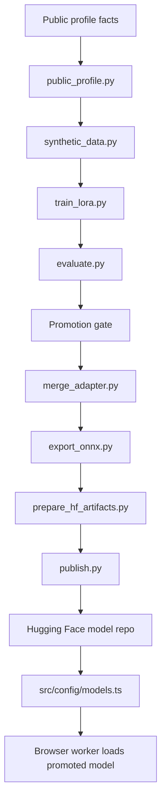

# Diagrams

This is the compact system map for humans and coding agents. It explains how
the static app, browser chatbot, and optional profile-QA fine-tuning pipeline
fit together.

## Source Of Truth

| Need | Primary file | Notes |
| --- | --- | --- |
| Site identity, repository, resume, links | `src/config/site.ts` | Drives the page and GitHub Pages URL derivation |
| Browser chatbot facts | `src/config/site.ts` | `PROFILE_SECTIONS` is the runtime context source |
| Training chatbot facts | `ml/profile-qa/profile_qa/public_profile.py` | Keep in sync with public facts when retraining |
| Prompt wording and generation knobs | `src/config/prompts.ts` | Includes welcome messages and generation parameters |
| Browser model and context limit | `src/config/models.ts` | Default is `int8` with `uint8` fallback |
| Prompt retrieval and budget trimming | `src/services/ai/contextProvider.ts` | Ranks profile sections and fits prompt/history into budget |
| Worker inference | `src/services/ai/worker.ts` | Runs Transformers.js off the main thread |
| LLM Visualizer | `src/components/profile/ProfileVisualizerModal.tsx` | Lazy client-only Three.js modal for the browser AI architecture trace |
| Local training defaults | `ml/profile-qa/profile_qa/config.py` | Holds model IDs, 1024-token budget, and LoRA defaults |
| Pipeline commands | `ml/profile-qa/README.md` | Command-level training, eval, export, and publish guide |

## Application Runtime

## Chat Generation Flow

## Static Export And Base Path

Rules:

| Rule | Detail |
| --- | --- |
| Production base path | Derived from `SITE_CONFIG.repository.name` |
| Asset paths | Do not hardcode `/justinthelaw` or any asset path in components |
| Static preview | `npm start` serves `out/`; run `npm run build` first, and the preview server infers the base path and redirects `/` to it |
| Deploy paths | CI deploys with GitHub Pages Actions; `npm run deploy` is the manual `gh-pages -d out` path |
| Static-only app | No API routes, server actions, or server-side data loading |

## Fine-Tuning Pipeline

Use this pipeline only when prompt/context edits are not enough. The browser app
does not train models and does not call a server.

## Fine-Tuning Configuration

| Step | Configure | Guardrail |
| --- | --- | --- |
| Facts | `src/config/site.ts` and `ml/profile-qa/profile_qa/public_profile.py` | Keep public facts aligned before generating data |
| Dataset | `python -m profile_qa.synthetic_data` | Generated data stays under ignored `ml/profile-qa/data/` |
| Training | `ml/profile-qa/profile_qa/config.py` or CLI flags | Fixed `teapotai/teapotllm` base; local 8GB NVIDIA LoRA/QLoRA runs |
| Evaluation | `python -m profile_qa.evaluate` | Seq2seq only; adapters must record `teapotai/teapotllm` as their base |
| ONNX export | `python -m profile_qa.export_onnx` | Requires the merged Teapot lineage marker; rejects `.onnx.data`; publishes `int8` and `uint8` encoder/decoder artifacts |
| App promotion | `src/config/models.ts` | Update `MODEL_ID` and keep `MODEL_CONTEXT_LIMIT` honest |

Promotion should satisfy the gate in `ml/profile-qa/README.md` before changing
the app default model.

## Agent Notes

| Note | Detail |
| --- | --- |
| Paths | Prefer exact file paths in documentation updates |
| Scope | Keep this file diagram-first and concise; put command details in `ml/profile-qa/README.md` |
| Flow changes | Update the matching diagram in the same change |
| Profile facts | Keep the TypeScript and Python profile sources synchronized when facts change for a retrained model |
