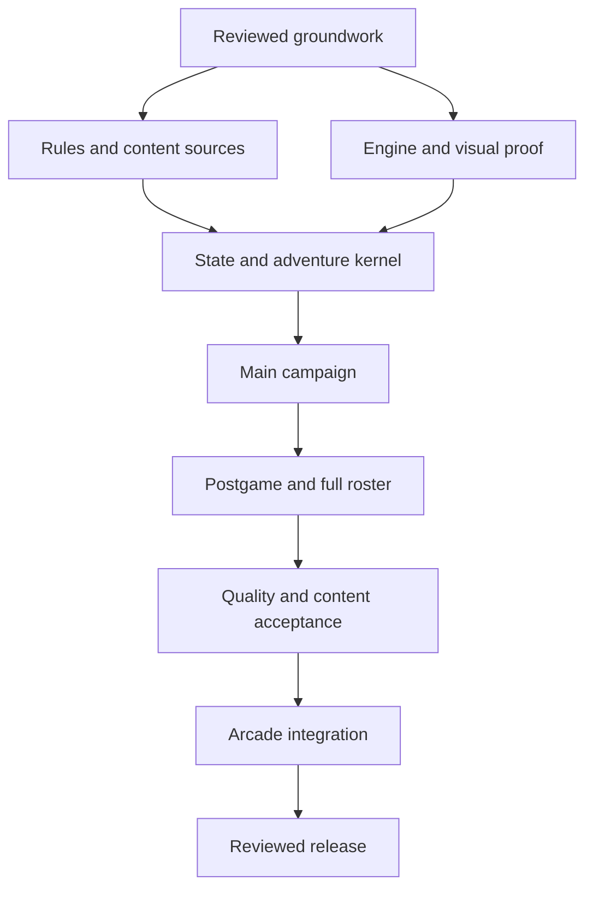

# Pokémon Dungeon Reimagined: implementation handoff

**Current authority (2026-10-05):** deliver the complete Blue campaign and
postgame described in [FULL-GAME-GOAL.md](FULL-GAME-GOAL.md). Latest visual
direction is faithful directional pixel characters in textured, illuminated
real 3D, superseding D03 B and earlier inferred P06 acceptance. The three new
pixel studies and tools-only viewer are Task 1 foundations, never full gameplay.
The [execution plan](FULL-GAME-EXECUTION.md) preserves all completion gates.

**Status: implementation authorized on 2026-10-04 after planning PR #387 merged. The unmerged foundation work includes reviewed P03-A/P04-A interfaces, a P05 startup shell and P06 art candidates. P01 remains incomplete; see PROGRESS.md and COVERAGE.csv for evidence and remaining gates.**

**Goal:** recreate the scope of the original Nintendo DS Blue Rescue Team adventure as a polished third-person 3D game served from Justin's arcade on GitHub Pages, with the entire main campaign, postgame, optional content, original rule systems, and a documented account of deliberate adaptations.

**Architecture:** a standalone, locally hosted browser game in `games/pokemon-dungeon-reimagined/`, with separate content, simulation, presentation, UI/input, audio, and persistence modules. The existing Next.js site exports that directory unchanged and opens its entry point in the existing arcade iframe. Simulation owns gameplay state; the renderer consumes presentation snapshots and cannot change game rules.

**Selected stack:** browser ES modules, JavaScript with JSDoc and an independent static type check, locally pinned Three.js/WebGL 2, local glTF/GLB and compressed texture/audio assets, HTML/CSS menus, browser storage through one adapter. Tooling, the local engine and the startup shell now exist; gameplay, production menus and persistence remain planned. No website React dependency, runtime CDN, server, Unreal runtime, account service, or game test runner.

**Spec:** this plan's approved requirements and the linked appendices constitute the specification. Instructions in AGENTS.md and later explicit user decisions take precedence. Justin's implementation-start instruction permits execution in the dependency order below; package acceptance, visual review and release authorization remain separate.

**For an implementing model:** read the authority order and execution protocol below before working. Work on one package or one explicitly bounded sub-batch at a time. Do not convert this plan into an invitation to build an abbreviated demo and label it the full game.

## 1. Review guide

| Read | Purpose | When an executor needs it |
| --- | --- | --- |
| This plan, sections 1-11 | Scope, decisions, architecture, constraints, task order | Every new implementation session |
| [CAMPAIGN.md](CAMPAIGN.md) | Story beats, original dungeon structure, postgame graph, scene/data work | P01-P02, P19-P31, final content audit |
| [SYSTEMS.md](SYSTEMS.md) | Rules, state and action contracts, ordering, services, persistence | P01, P07-P22, P33 |
| [DATA.md](DATA.md) | Roster, move and item data, provenance, dependency pinning, factual gaps | P01-P04, P14-P17, P32-P33 |
| [ASSET-PIPELINE.md](ASSET-PIPELINE.md) | Locked generation prompts, approved references, atlas grids, crop manifests and provenance | P03, P06, P32 |
| [ASSET-CONTRACT.md](ASSET-CONTRACT.md) | Reviewed bounded authoring/export and manifest interface | P03-P06, P32 |
| [RENDERING.md](RENDERING.md) | Visual direction, assets, camera, environments, UI, performance | P05-P06, P09-P10, P18, P32-P35 |
| [INTEGRATION.md](INTEGRATION.md) | Existing site paths, future first-card change, fixture tests, delivery gates | P00, P36-P37 |
| [RESEARCH.md](RESEARCH.md) | Source register, confidence rules, remaining research | Any disputed or unverified factual behavior |
| [DECISIONS.md](DECISIONS.md) | Recorded user decisions and actual generated visual assets | Justin's review; before implementing affected assumptions |
| [PROGRESS.md](PROGRESS.md) | Current state, review gates, next safe task, decisions | Start and end of every session |
| [COVERAGE.csv](COVERAGE.csv) | Completion inventory with evidence fields | Every content/system task |
| [Game AGENTS.md](../AGENTS.md) | Local execution constraints and release gates | Before any game file is edited |

Recommended review order for Justin: read sections 2-6, the milestone table in section 10, and the resolved decisions in section 12; then inspect the campaign and rendering appendices. The remaining work packages are the detailed handoff for the implementing model.

## 2. Current foundation scope

### Present on the unmerged implementation branch

- The planning baseline merged in PR #387, followed by Justin's implementation-start authorization; root/game AGENTS and the parent `games/README.md` retain the game/website boundary and release hold.
- This plan, source research, domain appendices, coverage and progress ledgers, including the source-qualified P01 profiles and their unresolved fields.
- Reviewed P03-A asset/export contracts and P04-A tooling under `tools/pokemon-dungeon/`, with pinned dependencies, independent static checks and a locally vendored Three.js 0.186.1 runtime.
- The P05 startup-only entry point, loading/error/retry UI and lifecycle handling. Direct-page, iframe and device acceptance remain open; no playable adventure or save implementation exists.
- P06 Pikachu, Charmander and Groudon candidates, animation/LOD exports, a Magma Cavern composition and an independent art-preview harness with measured manifests and actual captures. The latest pixel direction rejects these primitive rigid characters; new art/clip/device acceptance remains open.
- P02 normalized authoring inventories and P07-A identity, immutable snapshot and seeded random-stream primitives. These are not runtime-ready content, campaign creation or completed save validation.
- The approved Blue baseline, with two historical loading illustrations and their prompts/provenance. The latest directional-pixel/real-3D visual direction supersedes B; both illustrations are retained evidence.
- Recorded static checks and independent reviews, with their exact scope and limitations in PROGRESS.md. These do not complete P01, M1 or gameplay acceptance.

### Remaining work and gates

- Resolve source blockers before implementing dependent rules/content; complete the full campaign, systems, roster and production assets through the packages below.
- Obtain P05 manual acceptance and finish P06 clip/rig/device acceptance; retain P10 and all later visual and whole-game gates. The later explicit pixel direction supersedes the old inferred P06 acceptance.
- Keep the arcade card and public screenshot unchanged until P36/P37. Intermediate runtime work remains unmerged; merge and deployment require full-scope acceptance and explicit authorization.
- Keep root website package files and root README unchanged. Game authoring dependencies and the independent static-check workflow remain scoped to the documented tooling boundary.

Early unreviewed implementation drafts were removed during the historical planning stage. They are not accepted architecture, code, assets, validation evidence, or a starting point the next model should silently revive.

## 3. Scope and truthful completion

The target is a complete **reimagining of the original game scope**, not a byte-compatible ROM reconstruction. Three-dimensional staging, original art/audio and newly written dialogue, browser input, and browser saving are deliberate presentation/platform adaptations. These do not authorize dropping story chapters, recruitment rules, optional dungeons, species, move behavior, or original progression gates.

The phrase "Unreal engine-like" sets a visual aspiration: attractive materials, strong composition, coherent art direction, detailed characters, animated environments, intentional lighting, and polished effects. It is not evidence that a small primitive-mesh scene has reached the target. A visual-quality review is required before mass-producing assets. No claim of equivalent Unreal rendering technology or visual quality may be made without an approved result.

### Completion dimensions

| Dimension | Full-scope meaning | Insufficient substitute |
| --- | --- | --- |
| Campaign | All main story events, missions, setpieces, transitions, ending, departure, and return are playable and correctly sequenced | One paragraph before a list of dungeons |
| Postgame | Branching story routes, prerequisites, repeat encounters, rescues, recruitment, and endings work independently | All dungeons unlocked after credits |
| World | Original field dungeons, segments, fixed rooms, side paths, Friend Areas, town services, Dojo and edition-specific content represented | One random map with renamed themes |
| Roster | All 386 eligible Gen I-III species, relevant original forms, recruitment/evolution availability, distinct recognizable visual assets and animations | 386 names assigned to six generic body meshes |
| Mechanics | Original movement/turn rules, moves/PP/linking, abilities, statuses, items, hunger, IQ, recruitment, jobs, ranks and failure rules | Four attacks with identical damage formulas |
| Data | PMD-specific values and probabilities are sourced, represented and reviewed; approximations remain labeled | Modern PokéAPI defaults or main-series base stats presented as PMD stats |
| Visuals | Approved characters, environments, cinematics, UI and effects across the whole game with responsive performance | A single attractive Groudon screenshot |
| Delivery | Static local resources, coherent saves, recoverable failures, working website player and final delivery gates | A standalone page that only works from a development server |

An item can be researched, specified, implemented, statically reviewed, manually accepted, or released. These are separate states. A research source link or a schema row does not complete the feature.

## 4. Global constraints

1. Use the original Nintendo DS Blue Rescue Team as the product baseline, as explicitly selected by the user (D01 resolved). Red Rescue Team is a comparative research source only; do not add edition selection or import Red-only rules. DX and Explorers facts require explicit exclusion unless the user approves an adaptation.
2. Entry point: `games/pokemon-dungeon-reimagined/index.html`, currently a startup-only shell. The user allowed a folder, superseding the requested single `pokemon_dungeon_reimagined.html` file.
3. All runtime URLs are relative and resolve under `/justinthelaw/games/pokemon-dungeon-reimagined/`; no hard-coded root assets, CDN scripts, external fonts, or API-dependent content.
4. Keep the existing site architecture, system fonts, live GitHub bio, controls, tooltips, arcade width, margins and navigation intact.
5. Preserve the first card as Coming soon until the eventual release gate. Replace only that card, using a real gameplay capture, not concept art passed off as gameplay.
6. Game and website code must be DRY, SOLID, and idiomatic for their respective frameworks. Avoid a monolithic simulation/UI/renderer class.
7. Do not write or run tests against game source. No unit, integration, snapshot, automated gameplay, simulation replay test, or test-only game hook is permitted. Static syntax, lint, type, schema/provenance/size checks and code review are permitted. Manual gameplay/visual acceptance is approved under D05 and must remain distinct from automated website tests.
8. Website tests remain meaningful and thorough. Intercept every game iframe navigation with inert fixtures before it is triggered; test export copying with temporary fixture files. Never let a website test boot real game code.
9. Root README.md is unchanged. Keep governing requirements in root and game AGENTS files and details in their linked plan, research and progress documents.
10. Do not import website React/Zustand into the game. A standalone persistence adapter may use browser storage; no other game module accesses storage directly.
11. Every source-derived claim and external asset has provenance. Keep third-party notices and licenses. Create newly written dialogue preserving the original events, plus original art/audio, instead of extracting commercial game resources or copying a complete script.
12. Current pre-push policy rejects added files over 1,024 KiB. Optimize and partition assets; do not weaken that policy without an explicit reviewed decision.
13. Preserve canonical save data across retries, migrations and failed imports. No automatic reset on validation failure.
14. Planning-document-only changes may merge only with explicit user authorization. Every intermediate package containing runtime files remains review-only and unmerged until P37 full-scope release authorization; no interim runtime belongs on `main`. A disabled arcade card does not prevent access to a directly served game URL, because the exporter publishes the entire `games/` tree.

## 5. Authority order and uncertainty handling

Use this order when references conflict:

1. Latest explicit user instruction and approved decision log.
2. Root and game AGENTS constraints.
3. Approved portions of this plan and its appendices.
4. Edition-specific primary/manual evidence and corroborated original-game observations.
5. Specific original-game reference pages, followed by broader walkthrough summaries.
6. Proposed algorithms and examples in this plan.
7. Unreviewed drafts, assumptions, modern datasets, and memory: never authoritative.

Do not resolve an unknown by guessing while calling it researched. Create a research gap with an ID, affected fields/tasks, source candidates, a specific resolution question, and the dependent release gate. Research can proceed while independent setup work continues; dependent rule/content work must wait.

A source saying "20 floors" may include a terminal scene map that the game's displayed dungeon counter does not. Store exploration floors, actual boss floors, rest areas and external scenes separately. The campaign appendix is responsible for the normalized table and its uncertainty notes.

No rule should depend on an English display name. Use stable IDs for species/forms, actor instances, dungeon segments, map instances, quests, jobs, items, moves, abilities, scenes, flags and saves. Translate display text independently.

## 6. Selected architecture and design targets

| Topic | Selected direction | Reason and cost if changed |
| --- | --- | --- |
| Deployment | Native browser ES modules with all assets checked in under the game folder | Fits existing copy/export path; changing to a build-output folder later requires explicit export/build changes |
| Rendering | Locally pinned Three.js with WebGL 2 baseline; do not require WebGPU | Wide practical browser support; GPU quality still needs a physical-device acceptance pass |
| Source language | JSDoc-typed JavaScript, independent lint/type tooling scoped to game source | D08 approved: direct static serving, clear interfaces and strict independent static type checks |
| Turn model | Original tactical turns and logical grid, with smoothed 3D presentation and third-person camera | Retains Mystery Dungeon strategy; free-running real-time combat would be a different design |
| Camera | Follow camera with orbit/zoom, obstacle avoidance, recentering and an optional tactical overview | Makes the dungeon readable without returning to mandatory top-down play |
| Version | Original Nintendo DS Blue Rescue Team; no edition-selection UI | User-resolved D01; retain Red differences only as comparative provenance and implement Blue-specific scope |
| Artwork | Authored/licensed, individually recognizable character assets; procedural scenery and blockout allowed | Full roster art is a major production workstream; generic proxies cannot pass final completion |
| Narrative | Faithful Blue event coverage with newly written scene dialogue, staging and animation | Preserves storyline while avoiding copying original script text; writing still needs a full editorial pass |
| Saves | Versioned local slots plus export/import; shared store access isolated behind one repository | Works without backend; browser storage can be denied or cleared, so backup/recovery UX is required |
| Connectivity | Static code/file exchange for rescue features where feasible; no hosted matchmaking | Fits Pages; original hardware/link modes require explicit equivalence decisions |
| Difficulty | Preserve researched original rules and floor counts; accessibility assists, if added, are visibly optional | Avoids silently replacing the original campaign with a compressed mode |
| Release | Hidden development until full approved scope meets coverage and delivery gates | Matches the requested complete game; early public demos need separate user approval |

P04-A pins Three.js **0.186.1** in the independent tooling package and includes its local runtime module closure, license and provenance under `vendor/three/`. Reproduction and static-check commands are documented in the [tooling README](../../../tools/pokemon-dungeon/README.md). This bounded engine/tooling implementation does not establish full P04 or physical-device acceptance.

## 7. Architecture and file ownership

The startup shell (`index.html`, `styles.css`, `src/bootstrap.js`, `src/shell/`), `assets/initial-scene.json`, `vendor/three/`, game AGENTS and `plan/` documentation now exist. Other gameplay/content layers below remain planned. P06 authoring sources, candidate exports and the disposable preview remain outside the game tree under `tools/pokemon-dungeon/`. Do not create empty implementations merely to make this tree look complete.

| Path within `games/pokemon-dungeon-reimagined/` | Responsibility | Allowed dependencies |
| --- | --- | --- |
| `index.html`, `styles.css` | Existing loading shell and responsive startup UI; later semantic game surfaces | Application bootstrap only; no game rules in inline handlers |
| `src/bootstrap.js`, `src/shell/` | Existing startup composition, resource loading and lifecycle; later reviewed application wiring | Public interfaces of other layers |
| `src/contracts.js` | JSDoc typedefs and stable shared shapes | No runtime side effects |
| `src/domain/state.js`, `ids.js`, `rng.js` | Canonical serializable state, IDs and RNG streams | Plain data and utility functions |
| `src/domain/turns.js`, `actions.js` | Action validation, deterministic turn resolution | Domain services, never renderer/DOM/storage |
| `src/domain/navigation.js`, `generation.js` | Logical grids, reachability, geometry-independent movement | Dungeon data and RNG |
| `src/domain/combat/` | Damage, targeting, effects, abilities, move behavior registry | Actor/move/status data, RNG |
| `src/domain/items/` | Bag stacks, held items, use/throw/drop/pickup effects | Item data, actor/world state |
| `src/domain/party.js`, `recruitment.js`, `evolution.js`, `iq.js` | Team/roster identities and original advancement rules | Species/Friend Area/recruit data |
| `src/domain/jobs.js`, `town.js`, `progression.js` | Rescue work, services, story/postgame state transitions | Rule/content data and domain events |
| `src/persistence/` | Save repositories, validation, schema migrations, backup/import | JSON state contracts and browser adapters |
| `src/presentation/` | Read-only state-to-view projections and event queues | Domain snapshots; no mutation of live state |
| `src/rendering/` | Scene, camera, actor/model animation, environment, effects, resource ownership | Presentation snapshots, local Three.js and assets |
| `src/ui/` | Menus, journal, dialogue, HUD, focus, accessible text | View models and public commands |
| `src/input/` | Keyboard, pointer, touch and gamepad to commands | UI mode and action contracts |
| `src/audio/` | Original score, effects, buses, user-gesture start and lifecycle | Presentation events/settings |
| `content/` | Validated species/moves/items/dungeons/jobs/story/town tables | Stable IDs and provenance only |
| `assets/` | Existing initial-scene manifest; later accepted runtime character, environment, texture, UI and audio files | Manifest-listed local resources |
| `vendor/` | Existing pinned Three.js modules/license/provenance; add decoder resources only when required and reviewed | Exact local imports; retained licenses |
| `AGENTS.md`, `plan/` | Local constraints, execution/release gates and complete handoff | Existing instructions and documentation; never imported by runtime |

Authoring tooling lives at the repository-relative **`tools/pokemon-dungeon/`**, outside the exported `games/` tree. Its package/lockfile, lint/type/schema configuration, vendor and asset scripts, art sources, candidate manifests and art-preview harness now exist there; dependency installations and caches also belong there. Future data preparation scripts follow the same boundary. Static commands target `../../games/pokemon-dungeon-reimagined/` explicitly without importing or executing game source. Accepted browser runtime modules, data and assets belong in the game directory; authoring programs and dependencies remain outside it. The exporter also copies `plan/` and Markdown documentation, but the game must never request them as startup assets. The current exporter copies every file under `games/`, including ignored local files; `.gitignore` is not an export filter. Keep root website package files unchanged.

Reconcile each remaining module's name and contract with SYSTEMS.md before implementing it. If an appendix proposes a flat proof-of-concept module, map it to the responsibility above instead of adding a second source of truth. Record approved interface changes before downstream tasks consume them.

### Layer invariants

- Renderer receives immutable view snapshots/diffs, never the mutable canonical `GameState`.
- Animation completion cannot decide a hit, turn, recruit roll, stair transition or reward.
- Domain commands return an accepted/rejected result plus ordered domain events; rejected actions do not consume turns unless the original rule explicitly says so.
- World coordinates are integer grid `x,z`; renderer meters, interpolation and camera yaw are presentation-only.
- Use separate seeded streams for dungeon layout, encounters/items, combat/recruitment and cosmetic effects. Cosmetic randomness cannot change game results.
- Clock-based animation and audio pause independently of turn-based state. Backgrounding or losing focus must not advance gameplay.
- Event/quest reducers are idempotent for grants and transitions. Saving mid-dialogue cannot duplicate a reward or lose the only unlock item.
- Persistent roster records are keyed by `PokemonId`, and selected party lists reference those IDs. Session actors, clients and guests have unique `ActorId` identities with an optional `pokemonId` link. Never use a session actor ID as the persistent roster key or copy divergent persistent records.
- All UI strings derived from names/save imports use text nodes; no untrusted HTML interpolation.
- Persistence stores domain state and stable IDs, never Three.js objects, functions, DOM nodes, resource handles, or derived caches.

### Coordinate and timing conventions

The proposed logical map is `tiles[z][x]`, north is negative z, east is positive x. One renderer tile is 2 world meters. A camera behind its target has horizontal offset `(sin(yaw), cos(yaw))`; camera-relative forward maps to `(-sin(yaw), -cos(yaw))` before quantizing to a legal direction. These are internal presentation conventions, not claims about original code.

Simulation consumes discrete commands. Hold-to-walk queues at most one additional movement command while a step is presenting; menus and dialogue block movement input, key repeat never skips a choice, and key release/blur clears held input. Visual step duration is adjustable without changing the number of enemy turns. Confirm exact multiple-action/speed/status ordering from source before freezing the scheduler.

## 8. Content and asset production contracts

### Canonical content families

| Family | Required coverage | Critical distinction |
| --- | --- | --- |
| Species/forms | 386 recruitable species plus original relevant forms and NPC-only identities | Munchlax cameo is not a recruit; do not add Gen IV evolutions |
| Growth/availability | PMD stat curves, XP, recruit rates, body size, Friend Areas, evolution requirements, spawn floors | Main-series base stats and habitat fields are not equivalent |
| Moves | Original learned/TM/linked moves and PMD-only Wide Slash/Vacuum-Cut behavior | Typeless/system actions need their own IDs; modern damage categories/effects must not leak in |
| Abilities | Original PMD activation rules, multiple abilities and exceptions | Main-series descriptions are not executable specifications |
| Items | Food, healing, seeds, drinks, Gummis, TMs/HMs, orbs, projectiles, held items, key items and shop values | Quantity, stickiness, ownership, lost/broken effects and dungeon restrictions matter |
| Dungeons | Floor/segment tables, generation parameters, weather, spawns, shops, traps, fixed rooms, bosses and entry/revisit rules | Terminal scenes and rest areas are not automatically numbered floors |
| Jobs/rescues | Mission classes, clients, escorts, item delivery, rewards, deadlines/availability, ranks, mail and rescue exchange | Protect escorted clients and preserve generated job identity across saves |
| Story | Scenes, prerequisites, NPC states, dreams, travel, fugitive restrictions, construction, ending and postgame branches | Completion is a graph of flags/events, not a single dungeon array |
| Town/Friend Areas | Services, shop inventories, bank/storage/linking/Dojo, purchased/recruited areas, physical exploration | A menu name without working transactions is incomplete |
| Art/audio | Every creature/form, animation family, biome/setpiece, scene staging, UI, music/effects | A proxy material or reused primitive silhouette must remain marked proxy |
| Connectivity/version | Blue acquisition paths and extra modes, rescue codes/mail, historic event unlocks; Red differences only as research comparisons | Document browser equivalents and any user-approved omission |

### Data record requirements

Each authored record needs: stable ID; edition applicability; source IDs; factual confidence; values and units; dependencies; implementation status; and explicit adaptation notes when relevant. Do not use a boolean `complete` for all of these states. Keep factual source fields out of player-facing prose unless useful in a Credits/About surface.

Each asset manifest entry needs: stable ID; intended species/form/biome/use; author/source; license/permission record; local runtime path; file hash; encoded byte size; triangles or dimensions; material/texture/animation inventory; LOD links; review status; and approved screenshots. Third-party code additionally records package version, integrity/hash, source URL and complete required licenses.

### Provisional budgets, subject to visual approval

| Budget | Initial target | Action if exceeded |
| --- | --- | --- |
| Existing pre-push added-file limit | At most 1,024 KiB per file | Optimize/partition; do not silently bypass hook |
| Entire published game | At most 300 MiB proposed budget | Review asset inventory and demand loading; keep whole Pages site below published host limit |
| First interactive scene transfer | At most 8 MiB encoded | Load current scene/party first; defer roster/world assets |
| Active scene encoded assets | At most 24 MiB | LOD, atlases, mipmaps, reuse, fewer simultaneous unique models |
| Mobile frame target | 30 fps, stable pacing, no continuous loading stalls | Low quality profile, lower DPR/shadows/effects; preserve gameplay readability |
| Desktop frame target | 60 fps on an agreed midrange reference device | Profile expensive passes, draw calls and material count |
| On-screen input target | Minimum 44 CSS px touch target | Reflow rather than shrink controls into unusability |
| Quality validation | Actual representative devices plus desktop browsers | Emulated viewport results alone do not prove GPU performance |

These whole-game and device targets are not established by the bounded vendor/asset measurements recorded in PROGRESS.md. Reconcile rendering appendix budgets to this table before dependent production. GitHub currently documents a 1 GB published-site limit and a 100 GB/month soft bandwidth limit; record the host-source review date and recheck before release. Do not interpret the documented Pages deployment timeout as a guarantee about the duration of this repository's earlier build/test jobs.

## 9. Review focus and acceptance without game tests

The user excluded game-source tests. Preserve that constraint even when a generic coding skill recommends TDD. Use independent code review, source-backed rule tables, static analysis, manual player acceptance and visual evidence instead. Do not disguise a scripted automated game playthrough as a website check.

The highest-risk conditions requiring explicit review are:

1. **Reload/import during a transition:** exact turn, dialogue cursor, clients, RNG streams, key items and one-time grants survive without duplication or deletion.
2. **A branch unlocked out of the expected order:** each postgame branch respects all conjunctive prerequisites and never deadlocks a needed NPC conversation or Friend Area.
3. **Movement/targeting at geometric boundaries:** diagonal walls, terrain capability, line of sight, room edges, multiple-size sprites and camera occlusion preserve logical rules.
4. **Failure/revival/client loss:** story partner restrictions, recruited reserves, bag/money loss, rescue opportunities and reset dungeons follow the original edition.
5. **Static deployment under a prefix or unsupported device:** relative resource paths, denied storage/audio/fullscreen, low memory and WebGL context loss yield recoverable UI without corrupting saves.

### Permitted evidence

- Syntax checking, lint, independent static type checking and content schema/provenance inspection without executing game simulation.
- Human code review of rules, error paths, lifecycle/resource ownership and source correspondence.
- User-approved manual play logs naming edition/profile, save/checkpoint, actions, observed outcome, device and build SHA.
- Actual scene captures and manual performance measurements for the visual gate.
- Automated website tests using intercepted inert game HTML and temporary export fixtures.

### Not acceptable evidence

- "It compiles" presented as gameplay correctness.
- A list of all dungeon/species names presented as content completion.
- A fabricated screenshot or one polished scene presented as whole-game visual completeness.
- Test fixtures that load, import, instrument or drive actual game modules.
- Prior CI results for a different head SHA.
- An automated review request or eyes reaction presented as completed Codex review.

## 10. Milestones and dependencies

| Milestone | Packages | Deliverable | Gate |
| --- | --- | --- | --- |
| M0: groundwork | P00 | Plan, source research and reserved directory | Justin reviews and authorizes implementation |
| M1: factual/visual foundations | P01-P06 | Frozen initial rules/data schema, pinned toolchain, approved non-gameplay art preview | Source gaps affecting foundations resolved; visual direction accepted |
| M2: coherent adventure kernel | P07-P18, then P22 | World, turns, battle, items, party, saves, accessible presentation and reusable scene engine | Static review plus approved manual acceptance of the complete loop |
| M3: original main campaign | P19-P21, then P23-P26 | Onboarding through credits and return, all required services and scenes | Every main-story coverage row accepted; no abbreviated placeholder scenes |
| M4: full postgame and roster | P27-P33 | All branches, optional/version modes, full move/ability/data and art coverage | Zero unapproved missing-scope rows |
| M5: polish and release | P34-P37 | Device quality, whole-game manual evidence, first arcade card and delivery | Website checks, Codex review, explicit merge/deploy authorization |



**Canonical execution order:** P00-P18, then P22, then P19-P21, then P23-P37. Package IDs are stable references, not numeric execution priority. P22 provides the reusable scene engine needed by P19; authored campaign scenes follow in their content packages. Each package still requires its listed approval and accepted dependencies.

The graph is a dependency map, not permission to implement milestones in parallel without interface agreements. Art production and verified data transcription can overlap after their contracts are approved. Do not split writers across shared canonical state/content files without explicit ownership.

**Bounded foundation ordering, 2026-10-04:** Justin reiterated that the whole
game must work from beginning to end. P01 research may continue alongside
P03-A/P04-A after a focused review of their consumer contracts. These sub-batches
consume only the accepted Blue identity, presentation/platform decisions and
asset/export conventions; they consume no unresolved original-game mechanic.
This qualifies P04's P01 dependency for non-gameplay setup only. P01, M1 and
simulation/content acceptance remain incomplete; P05/P06 retain their listed
dependencies and reviews. Record each accepted interface before its consumer
proceeds. This does not permit guessing gameplay data or waiving visual gates.

**Current foundation state, 2026-10-05:** P03-A/P04-A consumer interfaces and the
bounded P05 startup interface have been reviewed; P06 candidates and art-preview
captures now exist. P05 manual loading/device acceptance and P06 full
device, clip and rig acceptance remain open; the latest continuation accepts
the shown scene/motion-study direction. See PROGRESS.md and COVERAGE.csv
for the evidence boundaries; these sub-batches do not complete P01-P06 or M1.

## 11. Small-model execution protocol

1. Read root and game AGENTS, PROGRESS.md, the next work package in section 10's canonical execution order, its contract sections and named appendix. Do not reread the entire research archive for a mechanical task.
2. Use the recorded implementation-start authorization and verify that this package or bounded sub-batch has accepted dependency evidence. Start authorization does not waive package acceptance.
3. Write a short task brief: inputs, outputs, owned paths, unresolved facts, proposed commands and finish criteria. Use this plan's exact names/values; flag contradictions before coding.
4. For a package with repetitive content, take one listed sub-batch. A move-effect family, one story scene group, or at most 8-12 finished creature assets is a sensible review unit; all 386 at once is not.
5. Implement one responsibility. Do not modify the website for a game-domain task or replace documented PMD rules with convenient defaults.
6. Perform only the permitted validation for the changed layer. Record what was not verified.
7. Obtain independent review of the changed responsibility, resolve findings, and update the coverage row and progress entry with evidence.
8. Commit only scoped paths. Open/update a focused review-only PR when the package is coherent; keep intermediate runtime PRs unmerged on the implementation branch or a documented dependent branch stack until P37. Do not mix a dependency refresh or unrelated website cleanup into it. A reviewed package advances its implementation branch, not public `main`; disabled Play does not prevent direct-URL exposure.
9. Before continuing, leave a handoff with commit SHA, files, exports/contracts, accepted decisions, remaining gaps, and exact next package/sub-batch.
10. If context is running low, stop at a coherent saved boundary. Never mark an incomplete component accepted to move on.

Suggested executor prompt:

> Read root AGENTS.md, games/pokemon-dungeon-reimagined/AGENTS.md, games/pokemon-dungeon-reimagined/plan/PROGRESS.md and work package Pxx in PLAN.md. Confirm that implementation was approved. Select Pxx by the canonical execution order, not numeric ID, and implement only its next uncompleted sub-batch using its listed appendix/contracts. Do not run tests against game source. Preserve root README and unrelated files. Record static review/analysis and any approved manual evidence, request focused review, update coverage/progress, and hand off the next task. Keep intermediate runtime PRs unmerged until P37 full-scope release authorization.

## 12. Recorded decisions

Justin selected B cel-shaded 3D on 2026-10-04, then superseded D03 on 2026-10-05 with directional pixel characters in textured real 3D and rejected primitive character anatomy. See [FULL-GAME-GOAL.md](FULL-GAME-GOAL.md) and [DECISIONS.md](DECISIONS.md) for current authority; the full campaign remains the target.

All product choices in this register are resolved. Justin subsequently authorized implementation. Research obligations and later quality/release reviews remain separate; merging and deploying still require explicit authorization.

| ID | Recorded decision | Binding selection or obligation | Affected work |
| --- | --- | --- | --- |
| D01 | **Resolved by user: Blue Rescue Team baseline** | Original Nintendo DS Blue only; no edition selector; Red remains comparative research | P01, P19, P21, P31 |
| D02 | **Engineering research obligation, not a user choice** | Preserve scope; do not guess numeric tables or claim exactness; resolve research gaps first | P01-P02, P14-P17, P33 |
| D03 | **Resolved: directional pixel / real 3D** | Latest EthrA reference supersedes B/no-pixel guidance and inferred rigid-mesh approval; preserve Blue character silhouettes, proportions and markings; review actual pixel creatures and textured 3D scene before roster production | P06, P32, P34 |
| D04 | **Resolved: browser equivalents** | Browser rescue codes/files, Blue extra-mode equivalents and archived event expeditions; preserve content/progression. Cartridge interoperability is not a required gate and may only be claimed where verified | P21, P31 |
| D05 | **Resolved: manual acceptance allowed** | Human play/visual review is allowed after implementation starts; all automated game-source tests remain excluded | Every gameplay/visual gate |
| D06 | **Resolved: omit standalone practice** | No separate Groudon practice mode; preserve the campaign battle and capture actual campaign gameplay for the arcade | P18, P35-P36 |
| D07 | **Established full-release hold** | Keep interim runtime off `main`; keep public card Coming soon until full-scope P36/P37 gates and explicit release authorization | P36-P37 |
| D08 | **Resolved: JavaScript with JSDoc** | Directly served ES modules with strict independent static type checks and game-scoped lint/schema tools | P04 |

The fixed browser-save recommendation is one current campaign with primary/backup recovery, automatic checkpoints after completed canonical state transactions, and manual save/export. SYSTEMS S03 owns exact trigger and recovery behavior; strict cartridge single-use quicksave is not a separate pending choice.

The approving decisions and subsequent implementation-start instruction are recorded in PROGRESS.md and both AGENTS files. Do not ask these choices again. Merge/deployment still require explicit authorization.

## 13. Work packages

### P00 - Planning and safe repository setup

**Status:** reviewed and merged in PR #387; implementation subsequently authorized. **Files:** root/game AGENTS, `games/README.md`, `tools/pokemon-dungeon/.gitignore`, this colocated documentation set. **Dependencies:** none.

- [x] Inspect current main, export/player components, contribution hooks, website test boundaries and existing instructions.
- [x] Clean only verified rebuildable outputs and retain source/tools.
- [x] Reserve the game directory; record the folder permission and planning stop.
- [x] Preserve the three public placeholders and unchanged root README.
- [x] Finish independent plan review and documentation checks.
- [x] Publish draft PR #387 for Justin with the then-active planning stop; later merge and implementation authorization are recorded above.

**Historical P00 acceptance:** the planning-only PR #387 diff contained no game runtime, vendor bundle, dependency change, live card update or test that executes game source. The user explicitly authorized two generated visual-planning assets; B was then selected as the future loading background and A an archived comparison under `plan/art-candidates/`, not approved 3D/gameplay art. Root README was unchanged; games/README used headings, tables and lists. The subsequent foundation implementation does not waive the recorded quality/release gates.

### P01 - Source audit and original-edition rules freeze

**Read:** RESEARCH, CAMPAIGN, SYSTEMS and DATA. **Produce:** source register, the Blue rules profile, Red comparison notes and resolved entries in the research-gap ledger. **Own:** documentation/content specifications only.

- [ ] Assign source IDs and retrieval dates to each rule family; prefer original manuals and edition-specific pages.
- [ ] Resolve floor-versus-scene counts, original type multipliers, turn/speed ordering, dual abilities, body/team limits, rank thresholds and original level-reset rules.
- [ ] Record Red/Blue differences as comparative evidence, resolve each product rule to Blue, and exclude DX/Explorers-specific behavior explicitly. Do not create an edition-choice flow.
- [ ] Resolve contradictory timing/prerequisite sources; preserve the disagreement and evidence rather than replacing it with a guess.
- [ ] Freeze the first implementable rules revision and identify later blocked records.

**Acceptance:** no dependent core rule is marked inferred-but-exact. Unknown numeric tables remain blocked with a specific question and source path. Review the source-to-rule mapping, not merely the number of links.

**Current sub-batches:** [Blue rules revision 1](RULES-BLUE.md) and its [additive revision](RULES-BLUE-ADDENDUM.md) record source-qualified foundations and remaining blocking fields. P01 is not complete until its unresolved rules and review gates are satisfied; the composed profile remains `runtimeReady: false`. Later packages may consume only the explicitly supported fields within their evidence scope.

### P02 - Complete inventories and traceability

**Read:** all content appendices. **Produce:** normalized inventories and one coverage row per actual feature/content/asset group. **Own:** `content` schema designs and coverage documentation.

- [ ] Enumerate all 386 species and original forms/NPC-only identities; all moves including PMD-only moves, abilities, item classes, statuses, traps, weather, IQ skills and Friend Areas.
- [ ] Expand every field/Dojo/version/event dungeon into segment, fixed-floor, terminal-scene and unlock records.
- [ ] Expand main/postgame story into scenes and flag transitions; include dreams, travel, town changes and re-entry conditions.
- [ ] Link each record to its source, implementation package, asset task and acceptance evidence slot.
- [ ] Reconcile totals without declaring unresolved categories complete.

**Acceptance:** a reviewer can trace each original feature to a planned implementation owner. A count is accompanied by the actual IDs and exceptions; no "etc." hides a content requirement.

### P03 - Asset/provenance pipeline specification

**Read:** DATA and RENDERING. **Produce:** asset schema, authoring/export conventions, dependency/license inventory and first approved asset brief. **Own:** authoring setup/config and manifests, not runtime gameplay.

- [ ] Define pixel cell/atlas dimensions, directions, foot anchors, frame timing, alpha/sampling, identities and clip coverage; retain scale/axis/material conventions for 3D environments.
- [ ] Define per-species/form asset IDs, LODs, facial/expressive coverage, shared rig families and per-asset identity requirements.
- [ ] Define texture/audio formats, compression, source ownership and license attribution fields.
- [ ] Follow ASSET-PIPELINE.md: lock one master prompt/reference strategy per asset family, generate small uniform sheets, verify grid alignment, crop from a manifest, and record prompts/hashes; directional pixel atlases supply current character animation; geometry supplies the real 3D environments.
- [ ] Keep authoring dependencies, caches and source exports under repository-relative `tools/pokemon-dungeon/` or the approved external art store; establish its ignore rules and the under-1,024-KiB runtime-file strategy.
- [ ] Agree where large original authoring files are retained without committing unsuitable binaries to the website repository.

**Acceptance:** no unknown-provenance asset enters runtime manifests. A fully attributed sample export has a local path, hash, size, dimensions/triangles, clips and a review image.

**Current bounded result:** P03-A's [asset contract](ASSET-CONTRACT.md) and manifest schema have passed consumer-interface review. Candidate exports now exercise that interface; full asset/provenance and human visual acceptance remain open.

### P04 - Independent game toolchain and pinned engine

**Dependencies:** P01, P03, D08. **Own:** repository-relative `tools/pokemon-dungeon/` package/lockfile, lint/type/schema configuration and preparation scripts; runtime vendor/license output under the game directory. **Consumes:** chosen runtime architecture. **Produces:** reproducible static game authoring/check commands.

P04-A may use the bounded foundation ordering in section 10: the reviewed
P03-A asset contract and accepted platform/edition decisions satisfy its
non-gameplay inputs. No unresolved P01 rule becomes an executable default.

- [ ] Pin Node compatibility to the repository's supported line and record exact chosen tool versions in `tools/pokemon-dungeon/package-lock.json`.
- [ ] Pin the selected Three.js release and required local module dependencies; record package integrity/hash and retain its license.
- [ ] Install authoring dependencies only in `tools/pokemon-dungeon/`; never create `node_modules`, tooling packages or authoring caches beneath `games/`. Add only necessary static lint/type/schema/asset-size tooling. There is no test script or test runner.
- [ ] Keep root package files unchanged. Ensure game checks do not accidentally invoke the website runtime or vice versa.
- [ ] Document vendor regeneration from exact pinned inputs; ensure no runtime import resolves to npm/CDN bare URLs.

**Acceptance:** a fresh contributor can reproduce the same local engine files and run static checks. No test runner appears in game scripts. Runtime source files stay directly statically servable.

**Current bounded result:** P04-A provides the pinned package/lockfile, Three.js 0.186.1 local closure, vendor provenance and independent static checks. Findings and command evidence are recorded in PROGRESS.md and the tooling README; this does not mark the full package accepted.

### P05 - Static application shell and lifecycle

**Dependencies:** P04. **Own:** `index.html`, `styles.css`, `src/bootstrap.js`, `src/shell/`, initial manifest and loading UI. **Produces:** a recoverable canvas application shell, not gameplay.

- [ ] Create semantic loading, unsupported-WebGL, asset-failure and retry states before initializing the renderer.
- [ ] Resolve asset/module URLs relative to the game entry point; never rely on domain-root hosting.
- [ ] Load only the initial scene manifest and show honest progress without inventing percentage precision.
- [ ] Handle hidden tabs, resize, device-pixel changes, iframe removal, context loss/restoration and cleanup.
- [ ] Reject failed/corrupt resource loads without mutating a save; allow title/settings/export access where possible.

**Acceptance:** static review covers every startup/lifecycle branch; approved manual capture shows direct-page and iframe loading/error states. No white screen or uncontrolled network fallback is accepted.

**Current bounded result:** the startup shell and its reviewed lifecycle interface exist. Direct-page, iframe and device observations remain pending; no gameplay or save operations are implemented.

### P06 - Visual target proof before mass production

**Dependencies:** P03-P05 and resolved D03/D05; implementation-start authorization is recorded, with bounded interfaces reviewed as described in section 10. **Own:** candidate production assets and a temporary repository-relative `tools/pokemon-dungeon/art-preview/` harness. **Produces:** reviewed art direction, static scene/animation captures and asset manifests, not gameplay or a production renderer.

- [ ] Build a bounded art-review harness outside the exported game tree using the pinned local Three.js toolchain. Load model/material/animation assets only; do not import game modules, domain state, commands, persistence or the future `DungeonRenderer` API.
- [ ] Produce finished Pikachu, a partner, and Groudon assets with idle, locomotion, attack, hit, sleep/faint and interaction clips appropriate to their role; playback previews pose/animation without battle outcomes.
- [ ] Produce Magma Cavern environment materials, lava, obsidian geometry, lighting, particles and sound mood using the intended production pipeline.
- [ ] Compose static third-person art views with foreground character visibility, readable ground and clearly labeled HUD layout mockups. These scenes contain no playable movement, turns, damage or encounter logic.
- [ ] Under approved D05, manually view/capture the art scenes on agreed devices at candidate low/standard/high settings and reduced motion; do not automate gameplay or treat art-preview performance as game performance.
- [ ] Record Justin's visual acceptance before mass production. Reuse accepted asset files/manifests in P10/P32; retire the disposable harness at integration rather than maintaining a second game renderer.

**Acceptance:** the asset/scene captures meet the approved look and remain labeled art previews. True game snapshot/event/renderer contracts freeze at P07/P10; P06 cannot claim campaign, battle, full renderer, or playable-slice completion. D06 omits a standalone practice mode; this harness must not introduce one. No P06 image becomes the public gameplay card preview.

**Historical bounded result:** rejected Pikachu, Charmander and Groudon rigid-mesh candidates have eleven clips each and three LODs; the Magma Cavern composition, measured manifests and actual captures are available in the [art review record](../../../tools/pokemon-dungeon/art/REVIEW.md). The latest pixel-art direction rejects these rigid-mesh character candidates; full device/clip/rig acceptance remains pending. Candidate validation and captures do not approve unseen production assets or complete P06.

### P07 - Canonical state, IDs and random streams

**Dependencies:** P01-P02. **Read:** SYSTEMS contracts. **Own:** `src/domain/state.js`, `ids.js`, `rng.js`, shared typedefs. **Produces:** canonical state creation and validated domain object identities.

- [ ] Define unique actor instances separately from species/forms, deployment lists, reserves and guest clients.
- [ ] Define world/map state, inventory ownership, story/job flags, edition/settings references and schema version.
- [ ] Define seeded RNG streams and state serialization; make cosmetic randomness independent.
- [ ] Make derived stats/views explicit and exclude them from authority when recalculation is safe.
- [ ] Specify accepted/rejected command results and ordered event payloads consumed by later layers.

**Acceptance:** static type/schema checks and independent review show no duplicate actor ownership, implicit name-based IDs, functions in saves, or gameplay dependence on render time.

### P08 - Persistence, migration and recovery

**Dependencies:** P07. **Own:** `src/persistence/` and save UI view models. **Produces:** one save repository interface used only by application services.

- [ ] Use one active campaign with versioned primary and recoverable backup slots. Follow the fixed browser-checkpoint policy in SYSTEMS S03: queue autosave after each completed state-changing command/scene transaction, provide manual save/export, and never claim uncommitted progress is durable. Strict cartridge single-use quicksave is not the browser model.
- [ ] Define save version, edition, checksum/hash purpose, saved timestamp and bounded payload.
- [ ] Validate record shape, allowed IDs, finite/bounded numbers, collection limits and unsafe object keys before accepting imported data.
- [ ] Write a temporary candidate, validate it, then promote; never delete the valid save because an import or migration failed.
- [ ] Preserve RNG state, scene cursor, clients and grant flags across saves; ensure temporary debug state cannot overwrite campaign slots.
- [ ] Handle denied/quota-limited storage with in-memory play and clear export advice; provide import preview and explicit destructive replacement confirmation.
- [ ] Keep migrations explicit per version and reject unknown future versions safely.
- [ ] Before load/import/reset/new-game replacement, recheck captured epoch, slot and source revision after all asynchronous preparation; reject stale operations without changing either the active campaign or stored save. Follow SYSTEMS for exclusive commit ownership.

**Acceptance:** code review traces interrupted writes, corrupt primary/backup, malformed imports and unsupported versions; D05-approved manual acceptance uses real save/export/import UI. No automated save/game test is added.

### P09 - Input mapping and interaction ownership

**Dependencies:** P05, P07. **Own:** `src/input/`. **Produces:** discrete commands and camera gestures, never direct actor mutation.

- [ ] Map keyboard movement/facing/diagonal controls, attack, move slots, wait, interact, inventory, tactics and menu cancel.
- [ ] Add pointer orbit/zoom/recenter and emulator-style semi-transparent controls that appear across the bottom half of the game screen, with left D-pad and right action buttons, at least 44px targets, safe-area spacing and show/hide behavior; preserve usable keyboard navigation. Follow RENDERING's complete input/visibility contract.
- [ ] Keep camera-relative input conversion separate from grid legality, and display orientation feedback.
- [ ] Gate inputs by UI mode; clear held input on blur, menu open, pointer cancellation and iframe focus loss.
- [ ] Support remapping and gamepad only through the same action map if included in the approved input scope.

**Acceptance:** static ownership review shows one action source and bounded queues; manual use shows no double turn, accidental menu choice, held movement after blur, or conflicting camera/touch gesture.

### P10 - Renderer, camera and resource ownership

**Dependencies:** P05-P07, P09. **Read:** RENDERING. **Own:** `src/rendering/` and immutable presentation adapters.

- [ ] Implement logical-to-world transforms, actor interpolation, animation selection and stable instance tracking.
- [ ] Implement follow/orbit/zoom/recenter and collision-aware camera placement; occluders fade or shorten the camera arm without changing the map.
- [ ] Render terrain and reusable props with instancing/merging where appropriate; separate static geometry from dynamic actors.
- [ ] Use explicit geometry/material/texture ownership, reference counting or scene resource scopes and disposal.
- [ ] Implement quality profiles and reduced motion without removing strategic information.

**Acceptance:** no render path writes domain state or re-rolls gameplay RNG. Scene transitions release resources, actors retain identity, and a wall/corridor does not hide the controlled character indefinitely.

### P11 - Dungeon generation and navigation

**Dependencies:** P01-P02, P07. **Own:** generation/navigation modules and dungeon structural tables.

- [ ] Represent walkable/wall/water/lava/void terrain separately from rendering props, traps, items and stairs.
- [ ] Generate rooms/corridors from edition-specific parameters with a deterministic seed; fixed rooms and bosses use explicit authored layouts.
- [ ] Guarantee legal connections between entry, exit and required mission targets; use bounded recovery/fallback generation rather than infinite retries.
- [ ] Implement eight-direction stepping, diagonal corner rules, swapping/team occupancy, movement abilities, room membership and line of sight.
- [ ] Place traps, items, shops, monster houses and spawns according to source-backed restrictions.
- [ ] Represent segment transitions/rest areas/external story maps without floor off-by-one errors.

**Acceptance:** static review checks connectivity guarantees and bounded generation; manual route inspection covers narrow corridors, terrain restrictions, fixed rooms and mission targets. Cosmetic geometry cannot create a logical wall mismatch.

### P12 - Turn scheduler and domain event ordering

**Dependencies:** P07, P09, P11. **Own:** action validator, scheduler and domain event queue.

- [ ] Freeze and document the original phase order, including speed stages, multiple actions, status duration, hunger/recovery, enemy/partner actions and end-of-floor checks.
- [ ] Separate input validation from turn consumption; identify original actions that consume a turn even when ineffective.
- [ ] Make each accepted action atomic with respect to save points and emitted events.
- [ ] Resolve simultaneous faint/revive/mission/floor transitions with explicit priority.
- [ ] Block reentrant commands while a domain transition is unresolved; UI animation timing cannot alter results.

**Acceptance:** reviewer can trace a complete turn from one command through all phases and explain every early exit. Do not freeze guessed speed/status ordering merely to unblock later tasks.

### P13 - Targeting and baseline battle rules

**Dependencies:** P01, P07, P11-P12. **Own:** combat targeting, damage/stat stages and common attack effects.

- [ ] Implement adjacent, directional, line, room, self and team targeting as source-backed targeting modes.
- [ ] Implement original basic attack, move accuracy, critical/STAB/type calculation and damage/stat modifier ordering.
- [ ] Distinguish PMD type immunity reduction from ability-based nullification; combine dual types correctly.
- [ ] Emit presentation events for hit/miss/effectiveness/heal/faint without coupling damage to animation.
- [ ] Define logs and accessible outcome text sufficient to play without deciphering particle colors.

**Acceptance:** each numeric factor and rounding point has a source or unresolved blocker. The original Red/Blue multipliers must not be replaced by main-series or Explorers values.

### P14 - Complete moves and abilities

**Dependencies:** P02, P12-P13. **Own:** move data, effect registry, ability registry and linking behavior.

Implement in independently reviewed batches: direct damage and stat changes; statuses and healing; multi-hit/multi-turn/recharge; movement/teleport/switching; room/line effects; item/terrain/weather interaction; copied/random/counter/fixed/HP-dependent effects; exceptional original PMD moves; ability prevention/redirect/trigger families; PP/link chains and unlink conditions.

For each batch:

- [ ] List exact IDs, original behavior, targeting, PP/accuracy and interactions before writing handlers.
- [ ] Add behavior through a reusable effect/ability interface; do not grow one unreviewable switch or give all moves generic damage.
- [ ] Define precedence when multiple abilities/statuses/held items interact.
- [ ] Update per-move/ability coverage, including genuinely unsupported cases and required animations.
- [ ] Review code against the table and record approved manual observations.

**Acceptance:** all original moves/abilities have reviewed behavior records; learning, replacing, remembering, toggling and linking actually work. No fallback handler silently stands in for an unimplemented named move at release.

### P15 - Items, traps, terrain, weather and status lifecycle

**Dependencies:** P12-P14. **Own:** item/status/trap/weather modules and their data.

Implement in batches: food and restorative items; seeds/status cures; Gummis/stat drinks; orbs; thrown projectiles; TMs/HMs; held items; keys/special quest items; trap families; terrain/visibility/weather; floor-transition cleanup.

- [ ] Preserve 20-slot original toolbox semantics and correct stack/held/sticky behavior.
- [ ] Implement use/give/take/throw/drop/pickup/trade actions, turn costs and ownership.
- [ ] Implement shop-floor debt/theft and consequences only after the source-backed transaction model exists.
- [ ] Track duration/stack/exclusivity of statuses and cleanup rules; do not treat every effect as a single string.
- [ ] Keep key progression entitlements separate from accidental bag-slot loss where an approved adaptation requires it; document the difference.

**Acceptance:** all listed effects have an owner, timing and UI feedback. No key quest becomes permanently impossible because of an implementation-only inventory deadlock.

### P16 - Hunger, recovery, fainting, rescue and reset dungeons

**Dependencies:** P08, P12-P15. **Own:** run lifecycle/failure services and reset-run snapshots.

- [ ] Implement original belly consumption/recovery rules, food changes and starvation damage.
- [ ] Implement revival items, leader/story-partner/client failure conditions, reserve return, original loss rules and rescue eligibility.
- [ ] Implement level-one, solo, no-item, money and party restrictions from each dungeon's entry policy.
- [ ] Preserve permanent progression while temporary dungeon state resets; restore the correct state on exit, rescue or defeat.
- [ ] Ensure retry/town/continue paths cannot duplicate rewards, consume a key item twice or overwrite a good save with temporary debug state.

**Acceptance:** each failure and exit path has a written state transition, loss list, save point and player-facing message. Restriction previews appear before irreversible run entry.

### P17 - Partner AI, recruitment, Friend Areas, evolution and IQ

**Dependencies:** P01-P02, P12-P16. **Own:** party, AI tactics, recruitment and advancement modules.

- [ ] Implement source-backed teammate tactics/skill use, target selection, pathing and client protection without omniscient map knowledge.
- [ ] Enforce member/body-size limits, leader/adjacency requirements, Friend Area ownership and species/dungeon recruit conditions.
- [ ] Distinguish recruitment offer, accepted run ally and permanent roster registration; handle loss before successful return.
- [ ] Implement original dual-ability/IQ/Gummi effects and configurable tactics rather than inert menu labels.
- [ ] Implement postgame leader changes and Luminous Cave evolution gates, items and form handling.
- [ ] Preserve actor identity, known/linked moves, learned facts and evolution eligibility through saves.

**Acceptance:** all 386 species have a verified obtainable/evolution path or a documented edition requirement; team limits and failure rules apply before adding an ally, not after corrupting party state.

### P18 - Complete player UI, map, accessibility and audio

**Dependencies:** P08-P17 and accepted visual direction. **Own:** UI, view models, audio buses and presentation effects.

- [ ] Implement title/continue/new game, HUD, minimap/journal, bag/item actions, party/tactics/IQ/moves, settings, help, save backup/import and errors.
- [ ] Make dialogue/menu focus deterministic, prevent background actions, restore focus, and keep cancellation semantics consistent.
- [ ] Show hunger/HP/PP/status/turn outcomes and objectives legibly at desktop, narrow mobile and short landscape heights.
- [ ] Add original score/effects, independent volume buses, mute, user-gesture start and suspension when hidden.
- [ ] Respect reduced motion, provide subtitles/text feedback, avoid color-only state, and retain 2-5 word action/destination tooltips.
- [ ] Label edition/adaptation information clearly without flooding normal gameplay with implementation details.

**Acceptance:** every menu item performs its claimed action or is explicitly unavailable with a reason. No placeholder controls, keyboard traps, clipped mandatory choices or unsolicited audio.

### P22 - Story engine, event graph and scene production

**Dependencies:** P08, P18. **Execution:** immediately after P18 and before P19. **Own:** reusable scene/quest contracts, event-graph evaluator and staging runner. No dependency on authored P19-P21 content.

- [ ] Define ordered scene commands, actors, camera cues, dialogue text, choices, conditions, one-time grants and terminal transitions.
- [ ] Implement replay-safe state transitions and scene cursor saving; skip/fast text does not skip essential rewards or decisions.
- [ ] Keep main-story chapter sequencing separate from conjunctive postgame quest prerequisites.
- [ ] Define source-to-scene traceability and an editing checklist for newly written dialogue that preserves original Blue events and causal order.
- [ ] Define schemas and staging support for rest stops, travel maps, dreams and town reactions. P19-P21 and P23-P31 supply their authored content later; this package does not require those scenes to be finished.

**Acceptance:** reusable contracts and implementation cover conditions, ordered commands, safe acknowledgments, atomic one-time grants, saved cursor/resume, transitions and presentation ownership. Static review traces these behaviors against P08/P18 contracts. The scene schema requires prerequisites, entry/exit state, cast, objective, newly written dialogue, assets and an acceptance record for later content packages; no claim that all authored scenes are already complete is permitted.

### P19 - Personality quiz, identity and initial rescue

**Dependencies:** P01-P02, P17-P18, P22 and resolved D01 (Blue). **Read:** CAMPAIGN. **Own:** onboarding content, starter/partner selection and Tiny Woods sequence.

- [ ] Apply the original Blue starter selection/personality/gender rules and partner type exclusions; do not add an edition selector. Obtain approval for any modernized identity/selection option.
- [ ] Write new quiz wording covering the same selection concepts and map scored results deterministically.
- [ ] Implement name/team identity with bounded validated input and accessible correction/back navigation.
- [ ] Stage awakening, the partner encounter, Butterfree/Caterpie rescue and team formation with the original event order.
- [ ] Teach movement, turn-taking, attack, items, stairs/rescue and saving through the actual game systems.

**Acceptance:** every eligible starter/partner path can begin the same campaign without invalid type combinations or broken starter moves; tutorial completion cannot skip required team/save setup.

### P20 - Town, mail and service economy

**Dependencies:** P15-P19, including P19's accepted P22 scene engine. **Own:** Pokémon Square/team base/Pelipper Post Office/Friend Area service content and transactions.

- [ ] Implement Kecleon shops, Persian bank, Kangaskhan storage, Gulpin linking/relearning, Wigglytuff Friend Areas, Makuhita Dojo and town travel.
- [ ] Implement original stock, price, capacity, linking cost, rank and access rules from verified data.
- [ ] Make all transactions atomic and reversible before confirmation where appropriate; no negative balances or duplicate stacks.
- [ ] Stage day changes, mail/jobs, dreams, partner conversations and story-conditioned NPC states.
- [ ] Implement physical Friend Area exploration and roster interaction, not only a purchase list.

**Acceptance:** each service has a complete opening/selection/confirm/cancel/feedback flow and the intended persistent effect; exact economy facts are sourced.

### P21 - Rescue jobs, ranks, mail and exchange features

**Dependencies:** P16, P20, D01/D04. **Own:** job generator/acceptance, mission objectives, mail/rewards/ranks and static exchange codecs/UI.

- [ ] Implement rescue, escort, delivery and other verified original mission categories with valid target floors/species/items.
- [ ] Persist accepted jobs, conflicts, client state, completion receipts and reward claiming; prevent duplicate claims.
- [ ] Use original rescue-point thresholds and rewards; distinguish story jobs from generated board/mail jobs.
- [ ] Specify the D04-approved visibly versioned browser-native job/rescue exchange format and map original content/progression. Original Wonder Mail or cartridge interoperability is optional and may only be claimed after its codec/region behavior is sourced and verified.
- [ ] Validate imported codes/files locally, bound input, reject unsupported or corrupt data and keep current saves intact.
- [ ] Document Blue-only hardware interaction equivalents and obtain approval before omission.

**Acceptance:** no backend is required. An arbitrary encoded JSON blob must not be advertised as original Wonder Mail compatibility. Mission generation cannot create an impossible client/item/floor combination.

### P23 - Main campaign: new team through Mt. Thunder

**Dependencies:** P19-P22. **Own:** opening campaign content and associated dungeon tables/assets. **Read exact sequences/floor records in CAMPAIGN.md.**

Sub-batches: Thunderwave Cave/Magnemite; Mt. Steel/Diglett/Skarmory; Team Meanies/Sinister Woods; Silent Chasm/Jumpluff; Mt. Thunder/Zapdos and Alakazam's team.

For each sub-batch: specify triggers and intervening town/mail/dream scenes; populate every floor/encounter/item/recruit rule; implement fixed rescue/boss maps; stage all dialogue/action; apply rewards/unlocks once; author relevant NPC/biome assets; review the complete route and return to town.

**Acceptance:** no dungeon is just a name/theme substitution; early services and recruitment appear at correct milestones, and the last accepted state leads coherently into the next arc.

### P24 - Main campaign: Xatu, accusation and fugitives

**Dependencies:** P23. **Own:** Great Canyon/Hill of the Ancients, town accusation/departure, Lapis Cave, Rock Path, Mt. Blaze/Moltres, Frosty Forest/Articuno, Absol, Snow Path and Mt. Freeze/Ninetales scenes.

- [ ] Implement Gardevoir dreams, the Ninetales legend and Gengar's actions with faithful causal order and newly written dialogue.
- [ ] Apply fugitive-era access/party/recruitment/mail/rest restrictions accurately; preserve safe preparation opportunities.
- [ ] Implement optional retreat paths without falsely advancing the main chapter.
- [ ] Stage pursuers, legendary encounters, Absol's joining and Ninetales' explanation in their correct maps.
- [ ] Restore town access and public reputation through explicit story state, not a generic dungeon-clear callback.

**Acceptance:** the player cannot buy/use unavailable town services while exiled, skip the emotional/causal arc, or turn Mt. Freeze's separate summit scene into an erroneous floor.

### P25 - Main campaign: rebuilding, Uproar and Groudon

**Dependencies:** P24. **Own:** base construction/chestnut events, Uproar Forest, failed rescue teams, Magma Cavern/Groudon and town response.

- [ ] Preserve the original Uproar floor structure and the extra Chestnut construction requirement.
- [ ] Stage the missing Alakazam team and failed rescue attempt that motivate the player's mission.
- [ ] Populate Magma's main/pit segments, rest/return behavior and fixed Groudon encounter with verified rules.
- [ ] Deliver accepted Groudon model/animations, cavern lighting, readable battle cues and complete rescue/return scene.
- [ ] Connect success to the meteor revelation rather than prematurely ending the story.

**Acceptance:** the eventual screenshot can be captured from a functioning real Groudon encounter, but the screenshot is not the package's only evidence.

### P26 - Main campaign: Sky Tower, meteor, departure and return

**Dependencies:** P25. **Own:** Gardevoir revelation, Teleport Gem, Sky Tower/Summit, Rayquaza, meteor resolution, aftermath, credits and returning protagonist.

- [ ] Stage all pre-departure conversations and the protagonist's role with newly written dialogue preserving the original events.
- [ ] Implement exact segment/boss structure and original access/revisit distinction, including the later Fly requirement.
- [ ] Produce Rayquaza and meteor cinematics with clear player control boundaries and skip-safe event grants.
- [ ] Implement departure, partner/town response, credits and post-credits return as distinct scenes/state changes.
- [ ] Unlock Luminous Cave, leader/partner freedom and initial postgame services only after the correct milestones.

**Acceptance:** credits do not merely unlock every dungeon. Save/reload at each ending stage resumes coherently, and the returned team has the correct postgame capabilities.

### P27 - Postgame: sea and buried ruins

**Dependencies:** P26. **Own:** Dive/Stormy Sea/Kyogre, Buried Relic, Regis, parts/Music Box, Mew and associated mail/town progression.

- [ ] Resolve acquisition and entry requirements, item possession/consumption rules, return/recruit conditions and floors.
- [ ] Implement fixed Regi battles and persistent artifact progression without accidental loss/duplicate grants.
- [ ] Implement Mew's actual encounter/recruit conditions; a guaranteed final-floor substitute is not faithful.
- [ ] Add newly written quest dialogue preserving the original events, NPC changes, ocean/ruin environments and complete branch return behavior.

**Acceptance:** this branch remains valid when other postgame branches are completed first or later; acquired entitlements/recruits drive downstream unlocks correctly.

### P28 - Postgame: Eon rescue, birds, Lugia and Deoxys

**Dependencies:** P26; cross-branch prerequisites from P27 as researched. **Own:** Southern Island/Surf, Northern Range/Latios, Pitfall Valley/Latias, original bird recruitment, Silver Trench/Lugia, Meteor Cave/Deoxys.

- [ ] Implement the town theft/pursuit/rescue arc and its conjunctive unlock conditions.
- [ ] Preserve the Legendary Island/Alakazam conversation chain and all Silver Trench prerequisites rather than testing one flag.
- [ ] Enforce original Water Pokémon/HM entry restrictions where required by sources.
- [ ] Implement Meteor Cave's special floor/encounter structure and Deoxys form behavior.
- [ ] Stage each return/recruit reward and unique environment/encounter asset.

**Acceptance:** no branch becomes unreachable after a valid alternative postgame order; special floors behave differently because of data/rules, not renamed generic layouts.

### P29 - Postgame: Spinda, beasts, Ho-Oh and Mewtwo

**Dependencies:** P26 and prerequisite item/area state. **Own:** Spinda wing event, Fiery Field/Entei, Lightning Field/Raikou, Northwind Field/Suicune, Mt. Faraway/Ho-Oh, Western Cave/Mewtwo.

- [ ] Implement the ordered wing transformations and relevant Surf/Friend Area/mission prerequisites.
- [ ] Preserve original floor counts, rest/access restrictions and encounter/revisit requirements.
- [ ] Distinguish defeating from recruiting Ho-Oh and Mewtwo when later events require one specifically.
- [ ] Author town connective scenes, legendary environments/animations and branch resolution.

**Acceptance:** the plan's branch order is represented in gates and dialogue; no DX floor total or auto-recruit convenience silently replaces original behavior.

### P30 - Postgame: Wish Cave and Gengar's redemption

**Dependencies:** P26 and researched Eon/sea/Friend Area prerequisites. **Own:** Team Meanies dialogue chain, Medicham rescue, Wish Cave/Jirachi/wishes, Gengar escort and Murky Cave/Gardevoir.

- [ ] Resolve the documented Stormy Sea prerequisite discrepancy before freezing event gates.
- [ ] Implement original level-one entry/reset rules, Wish Stone/wish conditions and repeat/recruit consequences.
- [ ] Implement escort/client rules and Ninetales/Murky Cave scenes with newly written dialogue preserving the original events and explicit moral/story outcomes.
- [ ] Separate terminal scene maps from exploration floors and implement Gardevoir's later recruitment correctly.
- [ ] Preserve all dialogue prerequisites across day changes and alternate branch completion order.

**Acceptance:** the branch is narratively complete, not an end-of-dungeon reward string. No single optional conversation can be irretrievably skipped by sleeping or doing another mission.

### P31 - Postgame: remaining challenges, optional/events and Dojo

**Dependencies:** P26 and prerequisite branch/content systems. **Own:** Purity Forest/Celebi, Joyous Tower, remaining field/Friend Area dungeons, Unown content, event/Wonder Mail dungeons, all original Dojo mazes and Blue-specific modes.

- [ ] Work from the enumerated DATA/CAMPAIGN inventories, not memory or a count-only checklist.
- [ ] Implement each restriction and fixed reward/recruit, including original level-one/solo/no-item conditions.
- [ ] Implement all 21 standard Dojo mazes and the Blue-specific Rescue Team Maze where applicable.
- [ ] Specify static-browser equivalents for wireless Unknown Dungeon/other hardware modes and retain original unlock intent where feasible.
- [ ] Make historical event dungeon access reproducible in the browser without requiring an unavailable distribution service; record the approved adaptation.

**Acceptance:** every inventory row is implemented/accepted or carries an explicit user-approved deviation. Purity Forest, Wish Cave and Mt. Faraway do not inherit DX values.

### P32 - Full creature, environment and narrative asset production

**Dependencies:** P03, P06, P18 and content specs. **Own:** assets, manifests, animation mappings and art coverage.

- [ ] Split roster production into reviewed batches of 8-12 species/forms with shared palette/timing tooling but distinct directional silhouettes and details.
- [ ] Produce idle/walk/turn/attack/hit/faint/interaction and role-specific clips; link move effects without pretending one motion covers every attack.
- [ ] Produce NPC-only characters, expressions, story costumes/props and all required scene animations.
- [ ] Complete every dungeon theme, town/service building, Friend Area, fixed boss arena and story location, including environmental variations.
- [ ] Produce original music/effect cues and complete UI/portrait/icon assets with consistent provenance.
- [ ] Remove or clearly gate every proxy from release manifests; audit LODs and scene combinations.

**Acceptance:** visual coverage is per entity/form/location/clip, not per procedural body archetype. Each asset batch has reviewed real captures at its intended camera distance and quality profile.

### P33 - Whole-game data and interaction audit

**Dependencies:** P14-P17, P21, P23-P32. **Own:** data corrections, missing effect families and final fidelity ledger.

- [ ] Reconcile roster/move/ability/item/trap/IQ/Friend Area totals and original edition/form exceptions.
- [ ] Cross-reference every floor's encounters, levels, rates, shops/traps/weather and every evolution/recruit path.
- [ ] Review combinations such as linked moves + PP loss, status + speed, client faint + revival, theft + escape, reset-run + evolution/recruit and save + one-time grant.
- [ ] Audit all prerequisites/rewards for graph cycles, permanently unavailable flags and conflicting edition gates by static data inspection.
- [ ] List each departure from original rules with impact, approval and player-facing disclosure where appropriate.

**Acceptance:** no unapproved unknown source fields, unsupported effect fallbacks, inaccessible content or proxy-art rows remain in release scope. Static completeness is still not a substitute for manual play acceptance.

### P34 - Performance, robustness and final visual polish

**Dependencies:** P32-P33. **Own:** rendering/presentation performance and loading/recovery improvements.

- [ ] Measure agreed real-device frame pacing, memory/resource lifetime, transfer size and load latency across representative large scenes.
- [ ] Tune resolution, shadows, particles, post-processing, visibility, draw batching, LOD and asset streaming per quality profile.
- [ ] Audit context loss, denied storage/audio/fullscreen, offline after local resources are loaded, slow/error responses and repeated iframe open/close.
- [ ] Review all scenes for camera occlusion, clipping, unreadable targets, UI overlap, color contrast, motion and audio consistency.
- [ ] Document measured limits honestly; do not claim unsupported device parity.

**Acceptance:** budget evidence names device/browser/version/build/scene/settings; unsupported capability paths are understandable and preserve saves.

### P35 - Manual whole-game acceptance and content sign-off

**Dependencies:** P33-P34; D05 approved. **Own:** review evidence and fixes to demonstrated issues.

- [ ] Complete a main-campaign play route through return using ordinary UI, without developer progression shortcuts.
- [ ] Complete every postgame branch in representative different orders and all optional/version content.
- [ ] Review each starter/partner compatibility class, recruitment/evolution coverage, restriction dungeon type and save/recovery path.
- [ ] Record rule/content discrepancies with reproducible human steps, affected saves, source references and fixes.
- [ ] Confirm visual/narrative/accessibility acceptance separately from mechanical coverage.

**Acceptance:** manual records are honest about sampled versus exhaustive observations; full-scope claims require completed coverage, not one playthrough or one screenshot. No automated game tests are introduced.

### P36 - First arcade card and website integration

**Dependencies:** accepted full release candidate from P35 and explicit permission to expose it. **Read:** INTEGRATION. **Own:** `src/config/arcade.ts`, `public/arcade/pokemon-dungeon-reimagined.jpg`, `games/README.md` and relevant website tests.

- [ ] Capture the actual Groudon encounter using the accepted game build and normal rendering; disclose any UI/pose/camera preparation and do not fabricate gameplay.
- [ ] Add a suitably optimized preview with accurate alt text and update only the first card's title/description/entryPoint.
- [ ] Keep two Coming soon blob cards, portal animation, shared sizing/tooltips, navigation and bottom padding.
- [ ] Test first-card image/enabled Play/no preload/iframe URL/focus/Back behavior with inert game responses registered before navigation.
- [ ] Test nested export/base-path behavior using temporary fixture files; never import or execute actual game source in website tests.
- [ ] Inspect website desktop/mobile renders and preserve fonts/live GitHub bio.
- [ ] Update the parent games README with the first game's accurate release-candidate status, description and entry point alongside the card; remove obsolete paused-planning wording without claiming it is already deployed. Preserve the remaining WIP/Coming soon records.

**Acceptance:** all website integration assertions pass on the pinned browser suite, and the production export contains the full local game resources at the expected path.

### P37 - Contribution review, PR delivery and deployment

**Dependencies:** P36. **Own:** scoped release PR, `games/README.md` release status, validation record and follow-up fixes.

- [ ] Run required game static checks, website `npm run flight-check`, pre-commit/pre-push hooks and `git diff --check`; distinguish infrastructure failures from source failures.
- [ ] Inspect the full diff, root README equality, source/asset notices, coverage inventory and scope deviations.
- [ ] Consolidate the reviewed, still-unmerged implementation branches into the full-scope release PR; verify the complete combined diff and retained package evidence. Open/update that PR with actual validation, gameplay capture, remaining limitations and relevant review evidence.
- [ ] Wait for every required check on the current head; diagnose/fix failures at their cause.
- [ ] Request GitHub Codex review if not already complete for that head, address actionable findings, and require a positive current-head completion signal.
- [ ] As part of approved release promotion, update games/README.md to the intended Live status and playable path, then include that catalog in the final reviewed diff and checks. The planning/current-development branch must not claim a live release.
- [ ] Obtain explicit merge/deployment authorization for this release, then monitor the main pipeline and verify live static assets/website integration and the published catalog against the deployed game.
- [ ] If deployment fails, start a scoped follow-up branch from current main and fix the cause without silently weakening checks; keep or correct the catalog status to accurately describe availability until deployment is verified.

**Acceptance:** current-head checks and automated review are complete, unresolved findings are addressed, the user has authorized publication, the deployed build is identified and verified, and the parent games catalog accurately matches live/WIP availability. Implementation-start authorization does not authorize this release gate.

## 14. Handoff record format

At the end of every package/sub-batch, add this record to PROGRESS.md:

```text
Package/sub-batch:
Approval/dependencies:
Base and resulting commit:
Owned paths changed:
Public interfaces added/changed:
Research sources and resolved gap IDs:
Static checks (command, exit status, actual result):
Independent review and addressed findings:
Manual evidence (D05 approved; record actual observations or not performed):
Coverage IDs advanced and evidence:
Remaining gaps/risks:
Next exact package/sub-batch:
```

Do not mark a package complete while its dependent contract is ambiguous, a named behavior is a placeholder, or review evidence is missing. Do not make a passing website suite carry claims about untested game behavior.

## 15. Current execution handoff

P00 was merged in PR #387, and Justin authorized implementation on 2026-10-04. The latest 2026-10-05 direction rejects the rigid-mesh character art and requires directional pixel characters in actual textured 3D; see [the art record](../../../tools/pokemon-dungeon/art/REVIEW.md). P05/P06 full clip/rig/device acceptance remains open. P02 normalized authoring inventories and the bounded [P07-A primitives](STATE-FOUNDATION.md) now advance implementation without consuming unresolved original mechanics. Continue P01 through [the rules profile](RULES-BLUE.md) and [its addendum](RULES-BLUE-ADDENDUM.md), resolving blocking fields before dependent rule/content implementation. Follow [PROGRESS.md](PROGRESS.md), [COVERAGE.csv](COVERAGE.csv) and section 10's bounded ordering. Full P01-P06 acceptance, the P06/P10 visual checkpoints, whole-game completion and P37 release authorization remain required.
